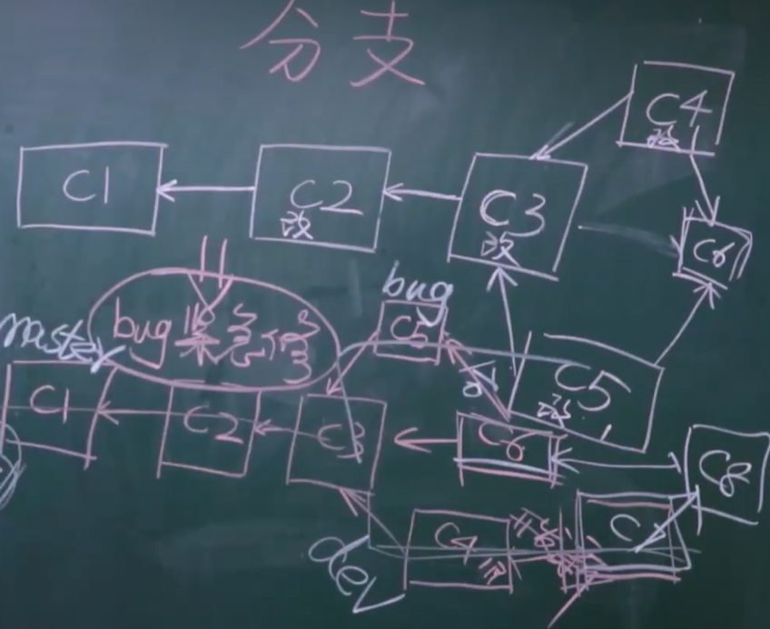

查看版本：修复BUG

```
git --version
```

版本控制：实质上是管理文件夹

```
1.进入要管理的文件夹
	-  右键 git bash here
2.初始化
	- git init
3.检测当前文件夹下的文件状态【红色】
	- git status 
4.让git管理 + 生成版本【绿色】
	- git add .
	- git commit -m "初始化"
5.查看历史版本
	- git log
	- git reflog

91.往前回滚
	- git reset --hard 版本号
	- git reset --hard 64130e8f0cb76ce173098f9024e61c082559c676
92.往后回滚
	- git reset --hard 版本号
	- git reset --hard 7af72c4
93.部分回滚：修改 =》 未修改
	- git checkout -- git.md
	
# 查看当前分支
git branch
# 创建分支
git branch dev
# 切换分支
git checkout dev

	
红色：新增文件或者修改文件  =》 git add .
绿色：git已经管理起来     =》 git commit -m "描述信息"
生成版本
```

补充：在commit前

```
个人信息配置：只需要执行一次
git config --global user.name "zhaoxiaoa"
git config --global user.email "amanscorner@163.com"
```

git三大区域：


分支：

第二个版本只保留新增部分，用指针指向第一个版本，类似于快照，不是全部拷贝。

分支的使用场景：修复之前的BUG。

 

开发新功能...

