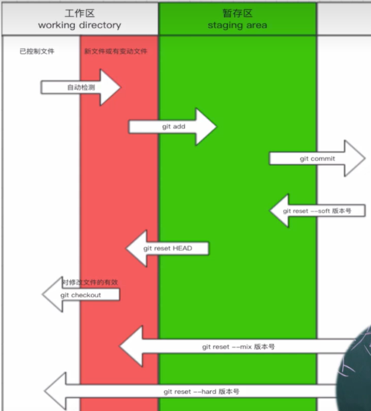

查看版本：修复BUG

```
git --version
```

版本控制：实质上是管理文件夹

```
1.进入要管理的文件夹
	-  右键 git bash here
2.初始化
	- git init
3.检测当前文件夹下的文件状态【红色】
	- git status 
4.让git管理 + 生成版本【绿色】
	- git add .
	- git commit -m "初始化"
5.查看历史版本
	- git log
	- git reflog

91.往前回滚
	- git reset --hard 版本号
	- git reset --hard 64130e8f0cb76ce173098f9024e61c082559c676
92.往后回滚
	- git reset --hard 版本号
	- git reset --hard 7af72c4
93.部分回滚：修改 =》 未修改
	- git checkout -- git.md
	
红色：新增文件或者修改文件  =》 git add .
绿色：git已经管理起来     =》 git commit -m "描述信息"
生成版本
```

补充：在commit前

```
个人信息配置：只需要执行一次
git config --global user.name "zhaoxiaoa"
git config --global user.email "amanscorner@163.com"
```

git三大区域：





分支：

第二个版本只保留新增部分，用指针指向第一个版本，类似于快照，不是全部拷贝。

分支的使用场景：修复之前的BUG。

```python
# 查看当前分支
git branch
# 创建分支
git branch dev
# 切换分支：开始开发
git checkout dev

# 修复BUG：
# 1.切换回master
git checkout master
# 2.创建bug分支并修复bug
git branch bug
git checkout bug
# add...
# 3.切换回master合并BUG分支
git checkout master
git merge bug
# 4.删除分支
git branch -d bug

# 继续开发：回dev分支
git checkout dev  # 此时还没有修复BUG
# add
# 切换回master合并dev分支
git checkout master
git merge dev  # 可能产生冲突，会报错，此时需要手动修复
git branch -d dev
```

 

工作流：


在家里：推送代码到仓库：

```python
# 给远程仓库起别名【只执行遍】
git remote add origin https://github.com/zhaoxiaoa/learn_git.git
# 向远程提交推送代码
git push -u origin master
git push -u origin dev
```

在公司：从仓库拉代码：

```python
# 克隆远程仓库代码【内部已经实现了起别名】
git clone https://github.com/zhaoxiaoa/learn_git.git
# 进到本地仓库中再执行其他命令
cd learn_git/
git branch
# 切换其他分支【默认看不到，但是可以切换】
git checkout dev
```

在公司：开始开发

```python 
# 切换到dev分支进行开发
git checkout dev
# 将主分支的代码合并到dev【只执行一次】
git merge master

# 开发代码
# add .
git push origin dev
```

在家里：

```python 
# 切换到dev分支
git checkout dev
# 拉代码
git pull origin dev

# 开发代码
# add .
git push origin dev
```

在公司：

```python 
# 切换到dev分支
git checkout dev
# 拉代码
git pull origin dev

# 开发代码
# add .
git push origin dev
```

....开发完毕要上线....

```python
# 开发代码
# add .

# 切换到master并合并dev
git checkout master
git merge dev
git push origin master

git checkout dev
git merge master
git push origin dev
```

换了场景后：

```
git pull origin master
git pull origin dev
```

